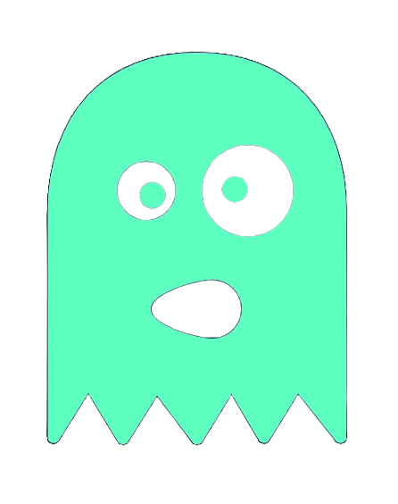

# Git URL Parse

This project is a golang port of an old project of mine [git-url-parse][],
which was donated to [coala][], and partially inspired by [go-git-url][].

It's usefulness may be limited, but I have a [fascination][] with revisiting
old projects.

 

[git-url-parse]: https://github.com/coala/git-url-parse
[coala]: https://coala.io/#/home?lang=Python
[fascination]: https://retr0h.github.io/gilt/
[go-git-url]: https://github.com/kubescape/go-git-url/tree/master

## Documentation

[Installation][] | [Usage][] | [Documentation][]

[Installation]: https://retr0h.github.io/git-url-parse/installation
[Usage]: https://retr0h.github.io/git-url-parse/usage
[Documentation]: https://retr0h.github.io/git-url-parse/

## License

The [MIT][] License.

[MIT]: LICENSE
